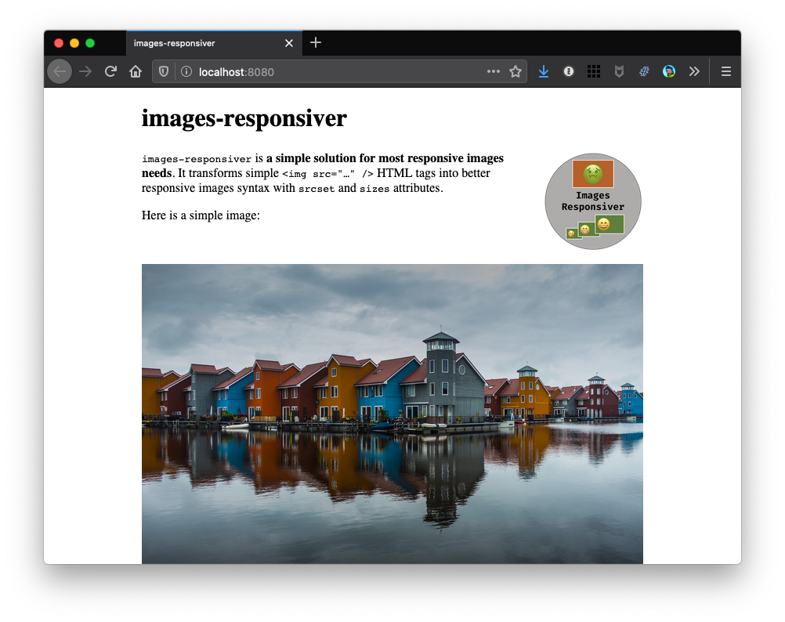

# Step 1: default behaviour without the plugin

## Run it

In the folder of the example, run a clean install then build:

```bash
npm ci
npm run build
```

Sources are in `src/` and build is in `dist/`.

## Check the result

If you open `dist/index.html` in a browser, both images should be visible.

Here is a screenshot on desktop:



And here on simulated mobile:


I you open it in different browsers, on different devices, with different viewport widths and screen densities, the very same image files are downloaded. Not cool for people on small devices with low resolution, and potentially bad connexions.

Let's try to enhance it with [step 2](../02-with-plugin-default/#readme).
