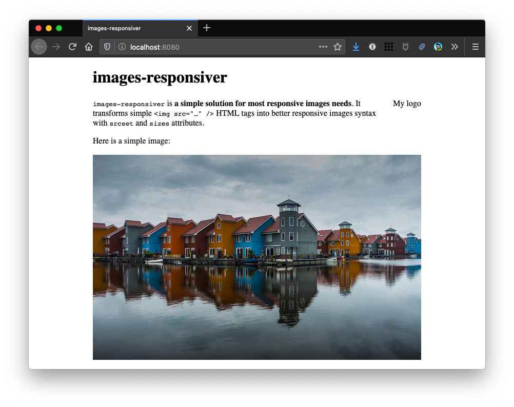
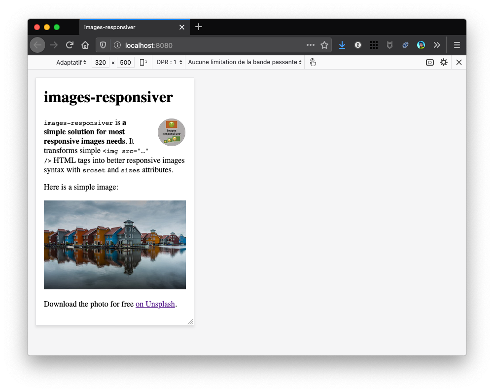

# Step 3: Resized images

## Run it

In the folder of the example, run a clean install then build in developer mode:

```bash
npm ci
npm start
```

Sources are in `src/` and build result is in `dist/`.

## Check the result

If you open `http://localhost:8080/` in a browser, images should be back. 🥳

Here is a screenshot on desktop:



And here on simulated mobile:



Oh… well, the photo is there in both screenshots, but the logo is there only on mobile… 🤔

## How does it (partially) work?

We didn't change anything in `.eleventy.js`.

We created the multiple resized images manually, so that they are available for the browser.

Unfortunately, the pristine (a.k.a. "untouched original") logo image is only 400 pixels wide, so we couldn't create images `my-logo-560.png`, `my-logo-800.png`, `my-logo-1040.png` and `my-logo-1280.png` the HTML is telling the browser about!

So while the `my-logo-320.png` version is perfect for the mobile view, the desktop view tries to load a larger one (after all, our HTML tells him it is available) and fails.

# Now… what?

So we have to find a way to tell the plugin the image's width, so that it doesn't add a larger one to the transformed HTML.

Let's see how to do this in [step 4](../04-images-dimensions/#readme)
