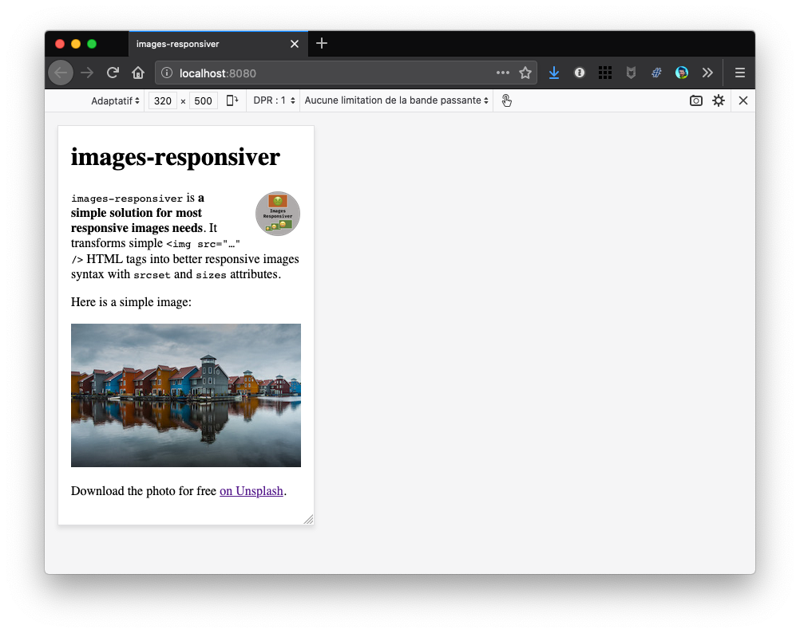

| **[<< back to home](../../)** | **[< back to step 3](../03-resized-images/#readme)** |

# Step 4: Images dimensions

## Run it

In the folder of the example, run a clean install then build in developer mode:

```bash
npm ci
npm start
```

Sources are in `src/` and build result is in `dist/`.

## Check the result

If you open `http://localhost:8080/` in a browser, all images should be back, on all viewports! 🎉

Here is a screenshot on desktop:


And here on simulated mobile:



## How does it work?

We wanted to tell the plugin about pristine images' actual widths, so that transformed HTML wouldn't include impossible withs.

Why invent a new parameter for the plugin? We already have the `width` attribute in HTML, so we used it, so that the plugin can read it.

To add the `width` attribute to HTML, we added it to our Markdown, thanks again to the [Markdown-it Attributes plugin](https://github.com/arve0/markdown-it-attrs) (remember the `logo` class on the logo image?).

For example, we replaced this:

```markdown
{.logo}
```

With this:

```markdown
{.logo}{width=400}
```

The plugin reads the image's width from the attribute in HTML (from the HTML, really, not from the image file properties), and uses it as a maximum value for the list of resized images in HTML.

If it was supposed to add a (or multiple) larger width(s), it doesn't, but it adds the pristine image's width. For example, if the plugin was supposed to generate 5 values from 320 to 1280 pixels, it would have generated this list: `[320, 560, 800, 1040, 1280]`. But the pristine image for the logo is 400 pixels wide, to the plugin generates only this list: `[320, 400]`.

_Note: If you fear forgetting to add a `width` attribute to some images, you can run the build in debug mode (learn [more about debugging here](/eleventy-plugin-images-responsiver/debugging.html)), you'll get warnings about missing `width` attributes. Instead of `npm start`, run `DEBUG=images-responsiver:* npm start`._

<!-- TODO
# Other ways to add the width attribute to images

- use the [`markdown-it-imsize` plugin](https://github.com/tatsy/markdown-it-imsize) with the `autofill` option, so that image width and height are added automatically (not tested yet)
- or use the `runBefore` hook in the plugin options to run a function that will add these width and height before any responsive transformation. That's [what I currently do for my site](https://nhoizey.github.io/images-responsiver/nicolashoizeycom.html).
 -->

# Now… what?

Unfortunately, there is still an issue with this transformed HTML.

Reading the transformed HTML, you might have noticed that both images' `sizes` attributes have the same value: `sizes="100vw"`. Which means the browser thinks both images are supposed to be rendered on the full width of the browser's viewport.

It's almost true for the big photo, at least on smaller viewports, but always really wrong for the logo, which is at most one fifth of the viewport.

It means **the browser still downloads images much larger than necessary**.

_Note: That's why the logo was visible on mobile in [step 3](../03-resized-images/#readme), because the viewport was 320 pixels wide, like the only available image. So what looked right was in fact wrong… 😅_

Let's see how to fix this in [step 5](../05-presets/#readme)
