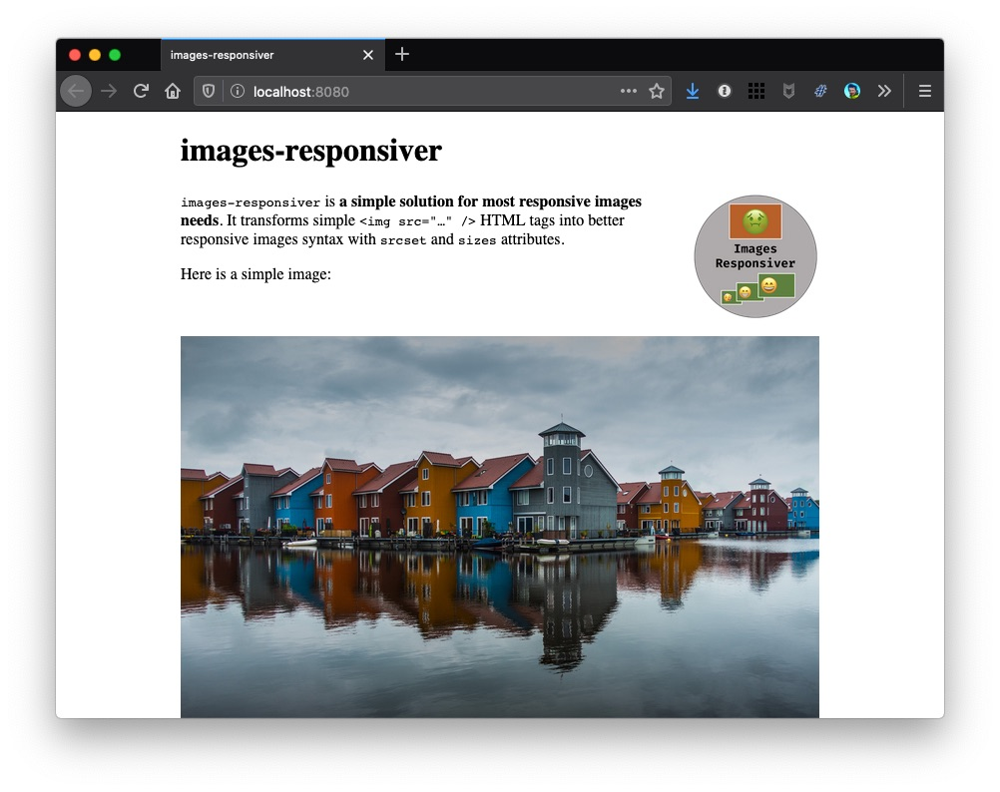
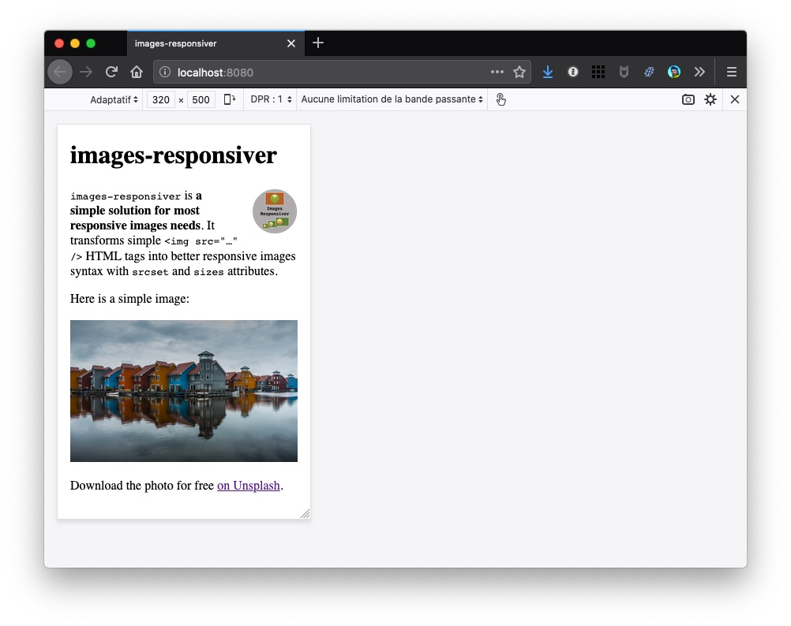

| **[<< back to home](../../)** | **[< back to step 0](../00-preparation/#readme)** |

# Step 1: Default behaviour without the plugin

## Run it

In the folder of the tutorial step, run a clean install then build in developer mode:

```bash
npm ci
npm start
```

Sources are in `src/` and build result is in `dist/`.

## Check the result

If you open `http://localhost:8080/` in a browser, both images should be visible.

Here is a screenshot on desktop:



And here on simulated mobile:



We used this CSS file:

<script src="https://gist-it.appspot.com/github/nhoizey/eleventy-plugin-images-responsiver/raw/master/docs/tutorial/01-without-plugin/src/assets/styles.css?footer=minimal"></script>

We want the content to take 90 % of the available space, but never more than `40em` (better for readability of multi-lines texts), and the logo to use 20 % of this content width, floated on the right.

_Note: We used the [Markdown-it Attributes plugin](https://github.com/arve0/markdown-it-attrs) to add a `logo` class to the logo image for styling (width, float on the right, etc.). This plugin allows adding attributes to elements using this syntax for example: `{.logo}`. This plugin will be even more useful later._

We can open this page in different browsers, on different devices, with different viewport widths and screen densities, **the very same (potentially heavy) image files will be downloaded**. Not cool for people on small devices with low resolution, and potentially bad connexions.

# Now… what?

Let's try to enhance it with the plugin in **[step 2](../02-with-plugin-default/#readme)**.
